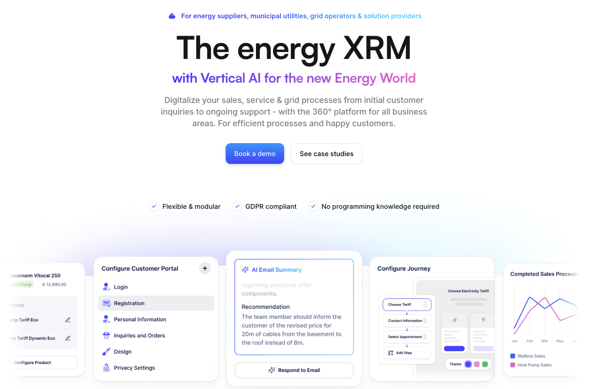

## Welcome to epilot!

- [Documentation](https://docs.epilot.io/docs/intro) — Guides, concepts, and platform references
- [REST API](https://docs.epilot.io/api) — OpenAPI specs, authentication, entities, webhooks
- [SDK](https://docs.epilot.io/docs/sdk/overview) — Typed TypeScript clients
- [Apps](https://docs.epilot.io/docs/apps) — Build and publish custom marketplace apps
- [Architecture](https://docs.epilot.io/docs/architecture/overview) — Microservices, SDK, and system design
- [Auth & Security](https://docs.epilot.io/docs/auth/security) — Access tokens, SSO, and permissions
- [Entities](https://docs.epilot.io/docs/entities/flexible-entities) — Flexible schemas and relations
- [Data Governance](https://docs.epilot.io/docs/data-governance/overview) — Data lifecycle policies and auditable deletions
- [Journeys](https://docs.epilot.io/journey-sdk-playground/index.html) — Embeddable forms and multi-step flows
- [Messaging](https://docs.epilot.io/docs/messaging/message-api) — Email, threads, and inbox management
